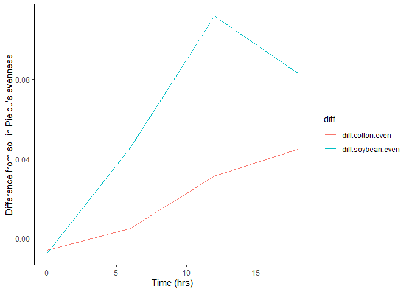

### Question 1

3pts. Download two .csv files from Canvas called DiversityData.csv and
Metadata.csv, and read them into R using relative file paths.

``` r
library(tidyverse)
```

    ## ── Attaching core tidyverse packages ──────────────────────── tidyverse 2.0.0 ──
    ## ✔ dplyr     1.1.4     ✔ readr     2.1.5
    ## ✔ forcats   1.0.0     ✔ stringr   1.5.1
    ## ✔ ggplot2   3.5.1     ✔ tibble    3.2.1
    ## ✔ lubridate 1.9.4     ✔ tidyr     1.3.1
    ## ✔ purrr     1.0.2     
    ## ── Conflicts ────────────────────────────────────────── tidyverse_conflicts() ──
    ## ✖ dplyr::filter() masks stats::filter()
    ## ✖ dplyr::lag()    masks stats::lag()
    ## ℹ Use the conflicted package (<http://conflicted.r-lib.org/>) to force all conflicts to become errors

``` r
diversity<- read.csv ("DiversityData.csv", na.strings = "na")
str(diversity)
```

    ## 'data.frame':    70 obs. of  5 variables:
    ##  $ Code      : chr  "S01_13" "S02_16" "S03_19" "S04_22" ...
    ##  $ shannon   : num  6.62 6.61 6.66 6.66 6.61 ...
    ##  $ invsimpson: num  211 207 213 205 200 ...
    ##  $ simpson   : num  0.995 0.995 0.995 0.995 0.995 ...
    ##  $ richness  : int  3319 3079 3935 3922 3196 3481 3250 3170 3657 3177 ...

``` r
meta<- read.csv ("Metadata.csv", na.strings= "na")
str(meta)
```

    ## 'data.frame':    70 obs. of  5 variables:
    ##  $ Code         : chr  "S01_13" "S02_16" "S03_19" "S04_22" ...
    ##  $ Crop         : chr  "Soil" "Soil" "Soil" "Soil" ...
    ##  $ Time_Point   : int  0 0 0 0 0 0 6 6 6 6 ...
    ##  $ Replicate    : int  1 2 3 4 5 6 1 2 3 4 ...
    ##  $ Water_Imbibed: num  NA NA NA NA NA NA NA NA NA NA ...

### Question 2

4 pts. Join the two dataframes together by the common column ‘Code’.
Name the resulting dataframe alpha.

``` r
alpha <-left_join(diversity, meta, by= "Code") #join the two dataframes into one and name it alpha.
head(alpha)
```

    ##     Code  shannon invsimpson   simpson richness Crop Time_Point Replicate
    ## 1 S01_13 6.624921   210.7279 0.9952545     3319 Soil          0         1
    ## 2 S02_16 6.612413   206.8666 0.9951660     3079 Soil          0         2
    ## 3 S03_19 6.660853   213.0184 0.9953056     3935 Soil          0         3
    ## 4 S04_22 6.660671   204.6908 0.9951146     3922 Soil          0         4
    ## 5 S05_25 6.610965   200.2552 0.9950064     3196 Soil          0         5
    ## 6 S06_28 6.650812   199.3211 0.9949830     3481 Soil          0         6
    ##   Water_Imbibed
    ## 1            NA
    ## 2            NA
    ## 3            NA
    ## 4            NA
    ## 5            NA
    ## 6            NA

### Question 3

4 pts. Calculate Pielou’s evenness index: Pielou’s evenness is an
ecological parameter calculated by the Shannon diversity index (column
Shannon) divided by the log of the richness column.

1.  Using mutate, create a new column to calculate Pielou’s evenness
    index.
2.  Name the resulting dataframe alpha_even.

``` r
alpha_even<-alpha%>% #create new dataframe called alpha_even(b)
 mutate(even=shannon/log(richness)) #mutate to create new column to calculate 
 #Pieloe's evenness by dividing the shannon column by the log of the richness column (a).

head(alpha_even) #check data frame.
```

    ##     Code  shannon invsimpson   simpson richness Crop Time_Point Replicate
    ## 1 S01_13 6.624921   210.7279 0.9952545     3319 Soil          0         1
    ## 2 S02_16 6.612413   206.8666 0.9951660     3079 Soil          0         2
    ## 3 S03_19 6.660853   213.0184 0.9953056     3935 Soil          0         3
    ## 4 S04_22 6.660671   204.6908 0.9951146     3922 Soil          0         4
    ## 5 S05_25 6.610965   200.2552 0.9950064     3196 Soil          0         5
    ## 6 S06_28 6.650812   199.3211 0.9949830     3481 Soil          0         6
    ##   Water_Imbibed      even
    ## 1            NA 0.8171431
    ## 2            NA 0.8232216
    ## 3            NA 0.8046776
    ## 4            NA 0.8049774
    ## 5            NA 0.8192376
    ## 6            NA 0.8155427

### Question 4

4.  Pts. Using tidyverse language of functions and the pipe, use the
    summarise function and tell me the mean and standard error evenness
    grouped by crop over time.

<!-- -->

1.  Start with the alpha_even dataframe
2.  Group the data: group the data by Crop and Time_Point.
3.  Summarize the data: Calculate the mean, count, standard deviation,
    and standard error for the even variable within each group.
4.  Name the resulting dataframe alpha_average

``` r
alpha_average<- alpha_even%>% #use the alpha dataframe and create new dataframe cammed alpha_average
  group_by(Crop, Time_Point)%>% #grouping by crop and time_point
  summarise(
    mean.even=mean(even), #mean of the Pielou’s evenness index from the new coumn named even
    n=n(),
    std.dev=sd(even), 
    std.err = (std.dev/sqrt(n))
  )
```

    ## `summarise()` has grouped output by 'Crop'. You can override using the
    ## `.groups` argument.

### Question 5

4.  Pts. Calculate the difference between the soybean column, the soil
    column, and the difference between the cotton column and the soil
    column

<!-- -->

1.  Start with the alpha_average dataframe
2.  Select relevant columns: select the columns Time_Point, Crop, and
    mean.even.
3.  Reshape the data: Use the pivot_wider function to transform the data
    from long to wide format, creating new columns for each Crop with
    values from mean.even.
4.  Calculate differences: Create new columns named diff.cotton.even and
    diff.soybean.even by calculating the difference between Soil and
    Cotton, and Soil and Soybean, respectively.
5.  Name the resulting dataframe alpha_average2

``` r
alpha_average2<- alpha_average%>% #new new data frame and use alpha_average as ref.
                 select(Time_Point, Crop, mean.even)%>% # select relevant columns
                 pivot_wider(names_from = Crop, values_from= mean.even)%>% #convert data to long form wide form
                 mutate(diff.cotton.even = Soil - Cotton)%>% #new column with difference from soil and cotton
                 mutate(diff.soybean.even = Soil - Soybean) #new column with difference between soil and soybean
```

### Question 6

4 pts. Conecting it to plots.

1.  Start with the alpha_average2 dataframe

2.  Select relevant columns: select the columns Time_Point,
    diff.cotton.even, and diff.soybean.even

3.  Reshape the data: Use the pivot_longer function to transform the
    data from wide to long format, creating a new column named diff that
    contains the values from diff.cotton.even and diff.soybean.even.

4.  This might be challenging, so I’ll give you a break. The code is
    below

5.  Create the plot: Use ggplot and geom_line() with ‘Time_Point’ on the
    x-axis, the column ‘values’ on the y-axis, and different colors for
    each ‘diff’ category. The column name ‘values’ come from the
    pivot_longer. The resulting plot should look like the one to the
    right

``` r
#still need to remove background!!!
alpha_average2%>% #part 6a
  select(Time_Point,diff.cotton.even, diff.soybean.even)%>% #6b
  pivot_longer(c(diff.cotton.even, diff.soybean.even), names_to = "diff")%>%#6c
  ggplot( aes(x = Time_Point, y = value, color = diff, group = diff))+
  geom_line()+
  xlab("Time (hrs)")+
  ylab ("Difference from soil in Pielou's evenness")
```

<!-- -->

### Question 7

Commit and push a gfm .md file to GitHub inside a directory called
Coding Challenge 5. Provide me a link to your github written as a
clickable link in your .pdf or .docx

[Katie Temple’s GitHub Coding Challenge 5
Directory](https://github.com/temkat/TempleReproducibilityClass2025/tree/69531926d11d94f37eec0ff0bfdad75b7e135173/CodingChallenge_5)
