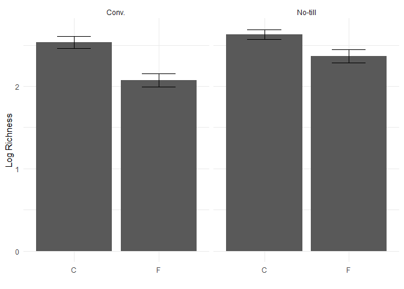

# Data Wrangling Notes

How to handle your data and make changes within R itself. This is
expansion on basic data handling within the program.

Tidyverse can do a lot and it’s worth looing at the link that was
provided. Time should be spent self-learning more about this package and
its capabilities. <https://tidyr.tidyverse.org/index.html>

Some of the material in this lesson includes: - mutate() - select() -
filter() - the pipe %\>% - summarise() - group_by() - joining -
pivotting - Integration with plotting

``` r
library(tidyverse)
```

    ## ── Attaching core tidyverse packages ──────────────────────── tidyverse 2.0.0 ──
    ## ✔ dplyr     1.1.4     ✔ readr     2.1.5
    ## ✔ forcats   1.0.0     ✔ stringr   1.5.1
    ## ✔ ggplot2   3.5.1     ✔ tibble    3.2.1
    ## ✔ lubridate 1.9.4     ✔ tidyr     1.3.1
    ## ✔ purrr     1.0.2     
    ## ── Conflicts ────────────────────────────────────────── tidyverse_conflicts() ──
    ## ✖ dplyr::filter() masks stats::filter()
    ## ✖ dplyr::lag()    masks stats::lag()
    ## ℹ Use the conflicted package (<http://conflicted.r-lib.org/>) to force all conflicts to become errors

``` r
microbiome.fungi<- read.csv ("Bull_Richness(1).csv")
str (microbiome.fungi)
```

    ## 'data.frame':    287 obs. of  16 variables:
    ##  $ SampleID       : chr  "Corn2017LeafObjective2Collection1T1R1CAH2" "Corn2017LeafObjective2Collection1T1R1CBA3" "Corn2017LeafObjective2Collection1T1R1CCB3" "Corn2017LeafObjective2Collection1T1R1FAC3" ...
    ##  $ Crop           : chr  "Corn" "Corn" "Corn" "Corn" ...
    ##  $ Objective      : chr  "Objective 2" "Objective 2" "Objective 2" "Objective 2" ...
    ##  $ Collection     : int  1 1 1 1 1 1 1 1 1 1 ...
    ##  $ Compartment    : chr  "Leaf" "Leaf" "Leaf" "Leaf" ...
    ##  $ DateSampled    : chr  "6/26/17" "6/26/17" "6/26/17" "6/26/17" ...
    ##  $ GrowthStage    : chr  "V6" "V6" "V6" "V6" ...
    ##  $ Treatment      : chr  "Conv." "Conv." "Conv." "Conv." ...
    ##  $ Rep            : chr  "R1" "R1" "R1" "R1" ...
    ##  $ Sample         : chr  "A" "B" "C" "A" ...
    ##  $ Fungicide      : chr  "C" "C" "C" "F" ...
    ##  $ Target_organism: chr  "Fungi" "Fungi" "Fungi" "Fungi" ...
    ##  $ Location       : chr  "Kellogg Biological Station" "Kellogg Biological Station" "Kellogg Biological Station" "Kellogg Biological Station" ...
    ##  $ Experiment     : chr  "LTER" "LTER" "LTER" "LTER" ...
    ##  $ Year           : int  2017 2017 2017 2017 2017 2017 2017 2017 2017 2017 ...
    ##  $ richness       : int  9 6 5 7 4 2 3 8 4 4 ...

### Select Function(): Selecting Colmns of Interest

Using the select() function allows you to select certain *columns* from
your data.

``` r
microbiome.fungi2<- select (microbiome.fungi, SampleID, Crop, Compartment: Fungicide, richness) #for the compartment the : is used to select all the columns in order through fungicide to year
```

### Filter Function: Another Way to Subset for rows

This is another way to subset data. The easiest way is the one that you
find the easiest personally. Is almost like the compantion to the select
function. This allows you to select certain *rows*. This is also similar
to basically telling coodinates of the data as well but with more clear
text almost.

``` r
head (filter (microbiome.fungi2, Treatment == "Conv."))
```

    ##                                    SampleID Crop Compartment DateSampled
    ## 1 Corn2017LeafObjective2Collection1T1R1CAH2 Corn        Leaf     6/26/17
    ## 2 Corn2017LeafObjective2Collection1T1R1CBA3 Corn        Leaf     6/26/17
    ## 3 Corn2017LeafObjective2Collection1T1R1CCB3 Corn        Leaf     6/26/17
    ## 4 Corn2017LeafObjective2Collection1T1R1FAC3 Corn        Leaf     6/26/17
    ## 5 Corn2017LeafObjective2Collection1T1R1FBD3 Corn        Leaf     6/26/17
    ## 6 Corn2017LeafObjective2Collection1T1R1FCE3 Corn        Leaf     6/26/17
    ##   GrowthStage Treatment Rep Sample Fungicide richness
    ## 1          V6     Conv.  R1      A         C        9
    ## 2          V6     Conv.  R1      B         C        6
    ## 3          V6     Conv.  R1      C         C        5
    ## 4          V6     Conv.  R1      A         F        7
    ## 5          V6     Conv.  R1      B         F        4
    ## 6          V6     Conv.  R1      C         F        2

``` r
# &
head(filter(microbiome.fungi2, Treatment== "Conv." & Fungicide == "C")) 
```

    ##                                    SampleID Crop Compartment DateSampled
    ## 1 Corn2017LeafObjective2Collection1T1R1CAH2 Corn        Leaf     6/26/17
    ## 2 Corn2017LeafObjective2Collection1T1R1CBA3 Corn        Leaf     6/26/17
    ## 3 Corn2017LeafObjective2Collection1T1R1CCB3 Corn        Leaf     6/26/17
    ## 4 Corn2017LeafObjective2Collection1T1R2CAF3 Corn        Leaf     6/26/17
    ## 5 Corn2017LeafObjective2Collection1T1R2CBG3 Corn        Leaf     6/26/17
    ## 6 Corn2017LeafObjective2Collection1T1R2CCH3 Corn        Leaf     6/26/17
    ##   GrowthStage Treatment Rep Sample Fungicide richness
    ## 1          V6     Conv.  R1      A         C        9
    ## 2          V6     Conv.  R1      B         C        6
    ## 3          V6     Conv.  R1      C         C        5
    ## 4          V6     Conv.  R2      A         C        3
    ## 5          V6     Conv.  R2      B         C        8
    ## 6          V6     Conv.  R2      C         C        4

``` r
#By usining the & symbol, you can select more specific rows of interest. In my own data I would likely select a site and a treatment in this case (fenced and trapped).

# OR (|)
head(filter(microbiome.fungi2, Sample == "A" | Sample == "B"))
```

    ##                                    SampleID Crop Compartment DateSampled
    ## 1 Corn2017LeafObjective2Collection1T1R1CAH2 Corn        Leaf     6/26/17
    ## 2 Corn2017LeafObjective2Collection1T1R1CBA3 Corn        Leaf     6/26/17
    ## 3 Corn2017LeafObjective2Collection1T1R1FAC3 Corn        Leaf     6/26/17
    ## 4 Corn2017LeafObjective2Collection1T1R1FBD3 Corn        Leaf     6/26/17
    ## 5 Corn2017LeafObjective2Collection1T1R2CAF3 Corn        Leaf     6/26/17
    ## 6 Corn2017LeafObjective2Collection1T1R2CBG3 Corn        Leaf     6/26/17
    ##   GrowthStage Treatment Rep Sample Fungicide richness
    ## 1          V6     Conv.  R1      A         C        9
    ## 2          V6     Conv.  R1      B         C        6
    ## 3          V6     Conv.  R1      A         F        7
    ## 4          V6     Conv.  R1      B         F        4
    ## 5          V6     Conv.  R2      A         C        3
    ## 6          V6     Conv.  R2      B         C        8

``` r
# Selects samples A or B. For own data I might do this with sex of the bird.
```

### Mutate (): Creating New Columns

Mutate() allows you to quickly create new columns.

``` r
#base r column creation
microbiome.fungi2$logRich <- log (microbiome.fungi2$richness)

#Create a new column with the name LogRich in a more straightforward fashion.
head(mutate(microbiome.fungi2, LogRich = log (richness)))
```

    ##                                    SampleID Crop Compartment DateSampled
    ## 1 Corn2017LeafObjective2Collection1T1R1CAH2 Corn        Leaf     6/26/17
    ## 2 Corn2017LeafObjective2Collection1T1R1CBA3 Corn        Leaf     6/26/17
    ## 3 Corn2017LeafObjective2Collection1T1R1CCB3 Corn        Leaf     6/26/17
    ## 4 Corn2017LeafObjective2Collection1T1R1FAC3 Corn        Leaf     6/26/17
    ## 5 Corn2017LeafObjective2Collection1T1R1FBD3 Corn        Leaf     6/26/17
    ## 6 Corn2017LeafObjective2Collection1T1R1FCE3 Corn        Leaf     6/26/17
    ##   GrowthStage Treatment Rep Sample Fungicide richness   logRich   LogRich
    ## 1          V6     Conv.  R1      A         C        9 2.1972246 2.1972246
    ## 2          V6     Conv.  R1      B         C        6 1.7917595 1.7917595
    ## 3          V6     Conv.  R1      C         C        5 1.6094379 1.6094379
    ## 4          V6     Conv.  R1      A         F        7 1.9459101 1.9459101
    ## 5          V6     Conv.  R1      B         F        4 1.3862944 1.3862944
    ## 6          V6     Conv.  R1      C         F        2 0.6931472 0.6931472

``` r
#You can create a new column which combines other ones such as Crop and Treatment
head (mutate (microbiome.fungi2, Crop_Treatment = paste(Crop, Treatment)))
```

    ##                                    SampleID Crop Compartment DateSampled
    ## 1 Corn2017LeafObjective2Collection1T1R1CAH2 Corn        Leaf     6/26/17
    ## 2 Corn2017LeafObjective2Collection1T1R1CBA3 Corn        Leaf     6/26/17
    ## 3 Corn2017LeafObjective2Collection1T1R1CCB3 Corn        Leaf     6/26/17
    ## 4 Corn2017LeafObjective2Collection1T1R1FAC3 Corn        Leaf     6/26/17
    ## 5 Corn2017LeafObjective2Collection1T1R1FBD3 Corn        Leaf     6/26/17
    ## 6 Corn2017LeafObjective2Collection1T1R1FCE3 Corn        Leaf     6/26/17
    ##   GrowthStage Treatment Rep Sample Fungicide richness   logRich Crop_Treatment
    ## 1          V6     Conv.  R1      A         C        9 2.1972246     Corn Conv.
    ## 2          V6     Conv.  R1      B         C        6 1.7917595     Corn Conv.
    ## 3          V6     Conv.  R1      C         C        5 1.6094379     Corn Conv.
    ## 4          V6     Conv.  R1      A         F        7 1.9459101     Corn Conv.
    ## 5          V6     Conv.  R1      B         F        4 1.3862944     Corn Conv.
    ## 6          V6     Conv.  R1      C         F        2 0.6931472     Corn Conv.

### Pipelines

As described directly in the tutorial as it’s super clear and probably
more useful then me tring to translate it into Katie language. “We can
also combine multiple functions together. This is an important concept
and is very powerful. It helps to try to visualize what you are doing to
your data at each step.

We will combine all previous steps into one large string of functions.

When we do this we do not have to specify the data in each function. The
data from the previous step is transferred to the next step.”

“Allows you to string things together.”

*Katie note:* This can be used instead of getting frustrated and just
making a new csv file. This also ensures I am not miscopying data.

``` r
#Can combine everything we did above in separate steps all into one step.
microbiome.fungi %>%
  select (SampleID, Crop, Compartment: Fungicide, richness) %>% #select columns
  filter (Treatment == "Conv.") %>% #subsetting to only include the conventional treatment rows.
  mutate(logRich= log(richness))%>% #creates a new column of the log richness
  head()#displays the first six rows of the data including column names.
```

    ##                                    SampleID Crop Compartment DateSampled
    ## 1 Corn2017LeafObjective2Collection1T1R1CAH2 Corn        Leaf     6/26/17
    ## 2 Corn2017LeafObjective2Collection1T1R1CBA3 Corn        Leaf     6/26/17
    ## 3 Corn2017LeafObjective2Collection1T1R1CCB3 Corn        Leaf     6/26/17
    ## 4 Corn2017LeafObjective2Collection1T1R1FAC3 Corn        Leaf     6/26/17
    ## 5 Corn2017LeafObjective2Collection1T1R1FBD3 Corn        Leaf     6/26/17
    ## 6 Corn2017LeafObjective2Collection1T1R1FCE3 Corn        Leaf     6/26/17
    ##   GrowthStage Treatment Rep Sample Fungicide richness   logRich
    ## 1          V6     Conv.  R1      A         C        9 2.1972246
    ## 2          V6     Conv.  R1      B         C        6 1.7917595
    ## 3          V6     Conv.  R1      C         C        5 1.6094379
    ## 4          V6     Conv.  R1      A         F        7 1.9459101
    ## 5          V6     Conv.  R1      B         F        4 1.3862944
    ## 6          V6     Conv.  R1      C         F        2 0.6931472

### Summarising Data

The summarise() function allows for finding things such as means and
standard deviations/errors.

``` r
microbiome.fungi%>%
  select (SampleID, Crop, Compartment: Fungicide, richness)%>% #selecting columns
  filter (Treatment == "Conv.")%>% #filtering for rows of interest
  mutate (logRich = log(richness))%>% #Creatres a new column with the log of richess
  summarise(Mean.rich = mean(logRich)) #Calculates the overall mean log richness within the conventionally managed treatment
```

    ##   Mean.rich
    ## 1  2.304395

This function also allows for multple summary statistics to be
calculated and displayed.

``` r
microbiome.fungi %>%
  select (SampleID, Crop, Compartment:Fungicide, richness)%>% #selecting columns
  group_by (Treatment, Fungicide)%>% #groups by the treatment and fungicide to later calculate summary stats by group!
  mutate(logRich= log(richness))%>% #creates new column with the log of the richness
  summarise(Mean.richnes = mean(logRich), #calculates the mean richness, st. dev, and standard deviation.
      n=n(),
      sd.dev= sd(logRich))%>%
  mutate(std.err= sd.dev/sqrt(n))
```

    ## `summarise()` has grouped output by 'Treatment'. You can override using the
    ## `.groups` argument.

    ## # A tibble: 4 × 6
    ## # Groups:   Treatment [2]
    ##   Treatment Fungicide Mean.richnes     n sd.dev std.err
    ##   <chr>     <chr>            <dbl> <int>  <dbl>   <dbl>
    ## 1 Conv.     C                 2.53    72  0.635  0.0748
    ## 2 Conv.     F                 2.07    72  0.696  0.0820
    ## 3 No-till   C                 2.63    72  0.513  0.0604
    ## 4 No-till   F                 2.36    71  0.680  0.0807

``` r
#If you want summary statistics by group, you can use the group_by() function.
microbiome.fungi%>%
  select (SampleID, Crop, Compartment:Fungicide, richness)%>%
  group_by(Treatment, Fungicide) %>% #groups by treatment and fungicide to later calculate summary stats by group.
  mutate (logRich = log(richness))%>%
  summarise (Mean.rich = mean(logRich),
             n = n(),
             sd.dev = sd(logRich))%>%
  mutate(std.err = sd.dev/sqrt(n))
```

    ## `summarise()` has grouped output by 'Treatment'. You can override using the
    ## `.groups` argument.

    ## # A tibble: 4 × 6
    ## # Groups:   Treatment [2]
    ##   Treatment Fungicide Mean.rich     n sd.dev std.err
    ##   <chr>     <chr>         <dbl> <int>  <dbl>   <dbl>
    ## 1 Conv.     C              2.53    72  0.635  0.0748
    ## 2 Conv.     F              2.07    72  0.696  0.0820
    ## 3 No-till   C              2.63    72  0.513  0.0604
    ## 4 No-till   F              2.36    71  0.680  0.0807

### Wrangling Data Into A Plot

With tidyverse you can use all of what is listed above in combination
with ggplot. *“In this case you would not have to enter the data
statement; you just need to start putting in aesthetics.”*

``` r
microbiome.fungi%>%
  select (SampleID, Crop, Compartment:Fungicide, richness)%>%
  group_by(Treatment, Fungicide) %>% #groups by treatment and fungicide to later calculate summary stats by group.
  mutate (logRich = log(richness))%>%
  summarise (Mean.rich = mean(logRich),
             n = n(),
             sd.dev = sd(logRich))%>%
  mutate(std.err = sd.dev/sqrt(n))%>%
  ggplot(aes(x = Fungicide, y = Mean.rich))+ #add in gg plot. switch from pipeline to "+"
    geom_bar(stat="identity")+ #bar graph
    geom_errorbar(aes (x=Fungicide, ymin=Mean.rich-std.err, ymax=Mean.rich+std.err), width=0.4)+
    theme_minimal()+
    xlab("")+
    ylab("Log Richness")+
    facet_wrap(~Treatment)
```

    ## `summarise()` has grouped output by 'Treatment'. You can override using the
    ## `.groups` argument.

<!-- -->

### Joining

There are a lot of joining functions and can be super useful. These are
functions that allow you to combine multiple data sets based on a common
set of variables.The variable names should match. ” - left_join() - Keep
all rows of X and add matching rows from Y. Any rows in Y that don’t
match X are excluded. - right_join() - reverse of left_join() -
inner_join() - only keep rows that are common to both X AND Y, remove
everything else. - full_join() - Keep any columns that are in either X
or Y ”

``` r
#Split data into separate sets
#just select richness and SampleID
richness <- microbiome.fungi %>%
  select(SampleID, richness)

#select columns that don't include metadata.
metadata <- microbiome.fungi%>%
  select (SampleID, Fungicide, Crop, Compartment, GrowthStage, Treatment, Rep, Sample)

head(metadata)
```

    ##                                    SampleID Fungicide Crop Compartment
    ## 1 Corn2017LeafObjective2Collection1T1R1CAH2         C Corn        Leaf
    ## 2 Corn2017LeafObjective2Collection1T1R1CBA3         C Corn        Leaf
    ## 3 Corn2017LeafObjective2Collection1T1R1CCB3         C Corn        Leaf
    ## 4 Corn2017LeafObjective2Collection1T1R1FAC3         F Corn        Leaf
    ## 5 Corn2017LeafObjective2Collection1T1R1FBD3         F Corn        Leaf
    ## 6 Corn2017LeafObjective2Collection1T1R1FCE3         F Corn        Leaf
    ##   GrowthStage Treatment Rep Sample
    ## 1          V6     Conv.  R1      A
    ## 2          V6     Conv.  R1      B
    ## 3          V6     Conv.  R1      C
    ## 4          V6     Conv.  R1      A
    ## 5          V6     Conv.  R1      B
    ## 6          V6     Conv.  R1      C

``` r
head(richness)
```

    ##                                    SampleID richness
    ## 1 Corn2017LeafObjective2Collection1T1R1CAH2        9
    ## 2 Corn2017LeafObjective2Collection1T1R1CBA3        6
    ## 3 Corn2017LeafObjective2Collection1T1R1CCB3        5
    ## 4 Corn2017LeafObjective2Collection1T1R1FAC3        7
    ## 5 Corn2017LeafObjective2Collection1T1R1FBD3        4
    ## 6 Corn2017LeafObjective2Collection1T1R1FCE3        2

``` r
#Now join.
head(left_join(metadata, richness, by = "SampleID")) #add richness data to the metadata based on the common column of sampleID
```

    ##                                    SampleID Fungicide Crop Compartment
    ## 1 Corn2017LeafObjective2Collection1T1R1CAH2         C Corn        Leaf
    ## 2 Corn2017LeafObjective2Collection1T1R1CBA3         C Corn        Leaf
    ## 3 Corn2017LeafObjective2Collection1T1R1CCB3         C Corn        Leaf
    ## 4 Corn2017LeafObjective2Collection1T1R1FAC3         F Corn        Leaf
    ## 5 Corn2017LeafObjective2Collection1T1R1FBD3         F Corn        Leaf
    ## 6 Corn2017LeafObjective2Collection1T1R1FCE3         F Corn        Leaf
    ##   GrowthStage Treatment Rep Sample richness
    ## 1          V6     Conv.  R1      A        9
    ## 2          V6     Conv.  R1      B        6
    ## 3          V6     Conv.  R1      C        5
    ## 4          V6     Conv.  R1      A        7
    ## 5          V6     Conv.  R1      B        4
    ## 6          V6     Conv.  R1      C        2

### Pivoting

Can be useful for converting from wide to long format and back again.
This is done with pivot_longer() and pivot_wider(). Long data is one
observation per sample. Wide data is multiple observations per row (like
resighting data to create an encounter history). Often you want to fo
from wide to long, but that is not always the case. Once you understand
the pivot_longer() function you will also understand wider.

``` r
microbiome.fungi %>%
  select (SampleID, Crop, Compartment:Fungicide, richness)%>%
  group_by(Treatment, Fungicide)%>%
  summarise(Mean= mean(richness))
```

    ## `summarise()` has grouped output by 'Treatment'. You can override using the
    ## `.groups` argument.

    ## # A tibble: 4 × 3
    ## # Groups:   Treatment [2]
    ##   Treatment Fungicide  Mean
    ##   <chr>     <chr>     <dbl>
    ## 1 Conv.     C         14.6 
    ## 2 Conv.     F          9.75
    ## 3 No-till   C         15.4 
    ## 4 No-till   F         13.1

Wide format- sets the values within the fungicide column into column
names. Goal of exercise is to calculate the difference in means.

``` r
microbiome.fungi %>%
  select (SampleID, Crop, Compartment:Fungicide, richness)%>%
  group_by(Treatment, Fungicide)%>%
  summarise(Mean= mean(richness))%>%
  pivot_wider (names_from=Fungicide, values_from = Mean) #pivots into wider format. This takes the name of the fungicide for new columns and the values for the new columns from the Mean.
```

    ## `summarise()` has grouped output by 'Treatment'. You can override using the
    ## `.groups` argument.

    ## # A tibble: 2 × 3
    ## # Groups:   Treatment [2]
    ##   Treatment     C     F
    ##   <chr>     <dbl> <dbl>
    ## 1 Conv.      14.6  9.75
    ## 2 No-till    15.4 13.1

``` r
#This new format alllows you to calculate the difference of the means for c and F.
microbiome.fungi %>%
  select (SampleID, Crop, Compartment:Fungicide, richness)%>%
  group_by(Treatment, Fungicide)%>%
  summarise(Mean= mean(richness))%>%
  pivot_wider (names_from=Fungicide, values_from = Mean)%>% #pivots into wider format. This takes the name of the fungicide for new columns and the values for the new columns from the Mean.
  mutate(diff.fungicide = C - F) #new column that is the difference between the two groups of C and F. 
```

    ## `summarise()` has grouped output by 'Treatment'. You can override using the
    ## `.groups` argument.

    ## # A tibble: 2 × 4
    ## # Groups:   Treatment [2]
    ##   Treatment     C     F diff.fungicide
    ##   <chr>     <dbl> <dbl>          <dbl>
    ## 1 Conv.      14.6  9.75           4.89
    ## 2 No-till    15.4 13.1            2.32

``` r
#Now create the plot of the difference of the means with ggplot.

microbiome.fungi %>%
  select (SampleID, Crop, Compartment:Fungicide, richness)%>%
  group_by(Treatment, Fungicide)%>%
  summarise(Mean= mean(richness))%>%
  pivot_wider (names_from=Fungicide, values_from = Mean)%>% #pivots into wider format. This takes the name of the fungicide for new columns and the values for the new columns from the Mean.
  mutate(diff.fungicide = C - F)%>% #new column that is the difference between the two groups of C and F. 
  ggplot(aes(x = Treatment, y=diff.fungicide))+ #rememeber since it has been piped (pipelined?) withe all the other functions you don't need to call the dataset again only the aesthic.
  geom_col()+
  theme_minimal()+
  xlab("")+
  ylab("Difference in average species richness")
```

    ## `summarise()` has grouped output by 'Treatment'. You can override using the
    ## `.groups` argument.

<!-- -->
