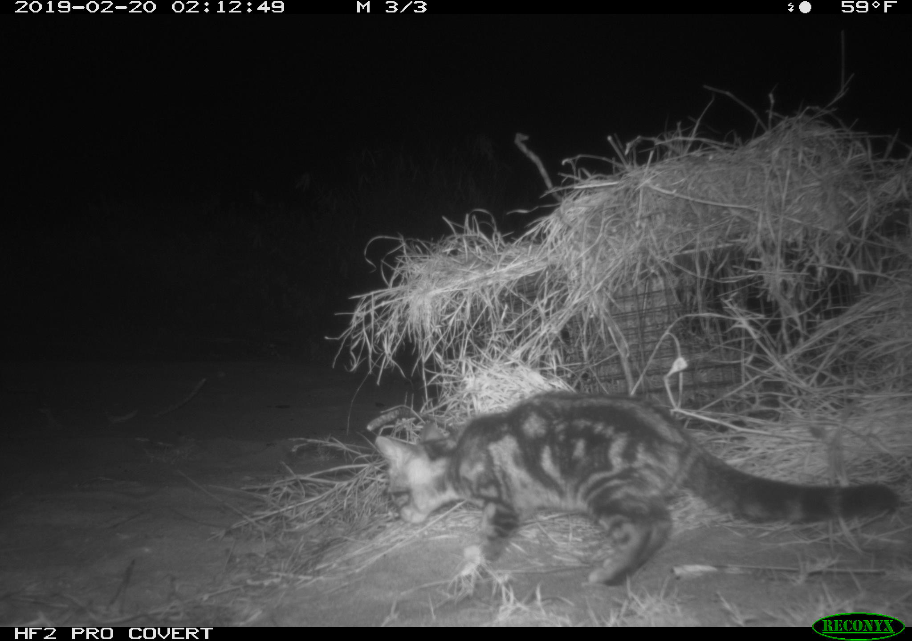

# Notes on rednering output documents for this.
title: "RmarkdownTurtialNotes"
author: "Katie Temple"
date: "2025-02-21"
output:
  md_document:
  variant: gfm  -this is for github "Github Flavored Markdown" should me an .md file
  (also the way we are going to create our READMEs)
html_document:
  toc: true  -generates a clickable table of contents
   toc_float: true -Generates floating table of contents like a webpage
word_document:
pdf_document:

```{r Can name your code chunks here, include=TRUE, echo=TRUE}
#Under name, include= TRUE  includes the code chunk output and FALSE foes not
#echo=TRUE will the code chunk, FALSE won't.
#If there are errors in the R code, the rendering of the document won't work
#It is one way to check yourself.
```

# Including figures
This is how you can include figures:
```{r Include Figure, include=TRUE, echo=TRUE}
library(ggplot2)
data("mtcars")
ggplot(mtcars, aes(x=wt, y=mpg))+
  geom_point()
```
# Notes on Section Headers

You can see how it generates when looking at the outline area to the right. YOU 
MUST INCLUDE SPACES AFTER EACH THE NUMBER OF ### YOU WANT TO GET THE HEADING TO 
RENDER
# First-level

## Second Level

#### subheader under the second level

### Third Level

# Style and Emphasis 

use the tilde key for the "`" backquote symbol. (is symbol below tilde)
to show if something is code specifically (like a function)

`ggplot()`


*italic* 
can be used for scientific names. Use single *before and after what you want italicized 

*Myadestes palmeri*


**bold** uses ** on either end of what you want bolded
**HELLO**


You can also insert blockquotes (for example a quopte that is clearly displayed in the final document, 
like at the beginning of a book chapter)
Blockquotes are written after ">"
example: 

 > "I thoroughly disapprove of duels. If a man should challenge me,  
 > I would take him kindly and forgivingly by the hand and lead him  
 > to a quiet place and kill him."  
 >
 > --- Mark Twain
 
Again, be super careful of actually using spaces 

# Lists
## Unordered Lists
 - one item
 - another item
 - another one
   - a sub item
   - another subitem
   - again
   
## Ordered Lists
 1. One
 2. Two
 3. Three
  - subitem 
  
# Inserting Links and Websites

### Not hyperlinked
`https://abcbirds.org/bird/puaiohi` 

### Hyperlink

<https://abcbirds.org/bird/puaiohi/> 


### Renamed Hyperlink
[Puaiohi (American Bird Conservancy)](https://abcbirds.org/bird/puaiohi/) 

# Inserting Images!
#If you forgot the exclamation mark (!), it will become just a link


# Creating and Formatting Tables in Markdown

First Header | Second Header
-------------| -------------
content cell | content cell
content cell | content cell

### Simpler Process Using kable package
```{r}

library(kableExtra)
kable(head(mtcars, n = 5), digits = 3, format = "markdown")#Generates table from data like the spreadsheet
```
# File Trees
Need fs package.
Don't forget to annotate your code 
```{r}
library(fs)
fs::dir_tree () #generates a straight up file tree 

├── 2025_2_20_DataVisualization3_ClassAssignment_mer0127(1).R
├── BacterialAlpha.csv
├── CodingChallenge2_TempleRedd.R #Scrupt for challenge 2
├── diff_abund.csv
├── MycotoxinData.csv #Data for Class Codign Challenges
├── RCNX0624.JPG
├── README.md
├── RMarkDownTutorialNotes_kat.md
├── RMarkDownTutorialNotes_kat.Rmd
├── RMarkDownTutorialNotes_kat_files
│   ├── figure-gfm
│   │   ├── Include Figure-1.png
│   │   └── pressure-1.png
│   ├── figure-html
│   │   └── Include Figure-1.png
│   ├── RMarkDownTutorialNotes_kat.docx
│   ├── RMarkDownTutorialNotes_kat.html
│   ├── RMarkDownTutorialNotes_kat.log
│   └── RMarkDownTutorialNotes_kat.tex
├── TempleReproducibilityClass2025.Rproj
└── Temple_Homework_DataVis2.R

```

